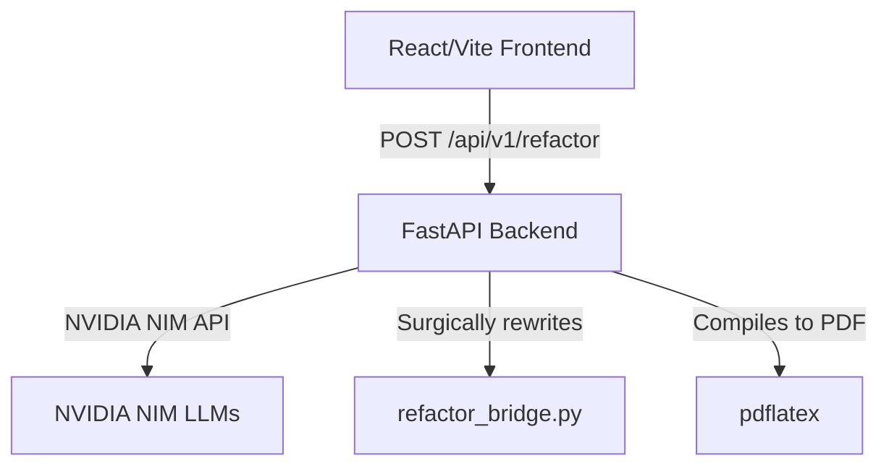

# ATS Resume Refactoring Engine — Current State Analysis

This document provides a comprehensive overview of the **ATS Resume Refactoring Engine** repository based on a static analysis of its structure, files, and flow.

---

## 1. Overview of the Application
The application is a web-based utility designed to tailor standard LaTeX resumes to job descriptions by extracting keywords and reframing professional experience and project accomplishments. It leverages high-performance LLMs via **NVIDIA NIM** APIs and renders the tailored resume into a single-page PDF using **pdflatex**.

---

## 2. Technical Stack & Component Topology

### Frontend (`frontend/`)
- **Framework**: React (v19) with Vite and TypeScript.
- **Styling**: Vanilla CSS with glassmorphic styling (e.g., custom MacWindow design).
- **Core Components**:
  - [App.tsx](file:///Users/saurav/Desktop/Desktop/Resume-Refactor/frontend/src/App.tsx): Manages the top-level application states, uploads, submission to FastAPI backend, downloads (PDF/LaTeX), and session cleanup.
  - [Hero.tsx](file:///Users/saurav/Desktop/Desktop/Resume-Refactor/frontend/src/components/Hero.tsx): Handles user authentication/API key entry.
  - [MacWindow.tsx](file:///Users/saurav/Desktop/Desktop/Resume-Refactor/frontend/src/components/MacWindow.tsx): Renders a beautiful window frame decoration.
  - [AppContent.tsx](file:///Users/saurav/Desktop/Desktop/Resume-Refactor/frontend/src/components/AppContent.tsx): Renders the primary dashboard where user pastes job descriptions, uploads LaTeX files, and downloads output.
- **Persistence**: All state is synced in real-time to `sessionStorage` (e.g., JD, Base Resume, Original Resume, Results, Company Name) to handle reload gracefully.

### Backend (`backend/`)
- **Framework**: FastAPI (Python 3.10+).
- **Core modules in `backend/app/`**:
  - [main.py](file:///Users/saurav/Desktop/Desktop/Resume-Refactor/backend/app/main.py): Registers `/api/v1/refactor` and `/health` endpoints. Handles orchestrating the multi-step resume refactoring pipeline.
  - [config.py](file:///Users/saurav/Desktop/Desktop/Resume-Refactor/backend/app/config.py): Load settings from `.env`, managing NVIDIA base URL, `FAST_MODEL` (`openai/gpt-oss-20b`), and `REASONING_MODEL` (`qwen/qwen3-next-80b-a3b-instruct`).
  - [keywords.py](file:///Users/saurav/Desktop/Desktop/Resume-Refactor/backend/app/keywords.py): Extracts strategic metadata (company name, mission/product, core problems) and technical/functional keywords. Implements a regex keyword-bolding parser.
  - [llm.py](file:///Users/saurav/Desktop/Desktop/Resume-Refactor/backend/app/llm.py): Deconstructs candidate's resume, reframes the bullets to address specific company needs, and applies rigid constraints (maintains identical bullet counts, role names, and limits bullet lengths to 180 characters).
  - [bridge.py](file:///Users/saurav/Desktop/Desktop/Resume-Refactor/backend/app/bridge.py): Python wrapper that loads the custom [refactor_bridge.py](file:///Users/saurav/Desktop/Desktop/Resume-Refactor/.claude/skills/resume-refactor/refactor_bridge.py) skill using a `sys.path` injection.
  - [compile.py](file:///Users/saurav/Desktop/Desktop/Resume-Refactor/backend/app/compile.py): Runs local `pdflatex` to build the resume in a temporary directory and adjusts `\linespread` (e.g., `0.92`) dynamically to force a single-page output.
  - [models.py](file:///Users/saurav/Desktop/Desktop/Resume-Refactor/backend/app/models.py): Specifies Pydantic models for validation.

### Core LaTeX Parser Engine (`.claude/skills/resume-refactor/`)
- **[refactor_bridge.py](file:///Users/saurav/Desktop/Desktop/Resume-Refactor/.claude/skills/resume-refactor/refactor_bridge.py)**: A standalone, 638 LOC surgical parser using the `TexSoup` library.
  - Extracts section titles (`Professional Experience`, `Projects`).
  - Matches update requests with existing `itemize` environments inside sections using fuzzy label matching and positional logic.
  - Injects rewritten bullets without disturbing LaTeX headers, footers, margins, or other section structures.

---

## 3. Data Processing Flow

1. **User Request**: User pastes a Job Description, uploads their base LaTeX resume (falls back to [resume.tex](file:///Users/saurav/Desktop/Desktop/Resume-Refactor/resume.tex)), provides their NVIDIA API Key, and hits "Refactor".
2. **Keyword Extraction**: Backend uses the cheap, fast model (`gpt-oss-20b`) to extract strategic context (company, mission, problems) and up to 15 keywords.
3. **Bullet Rewriting**: Backend calls the reasoning model (`qwen3-next-80b-a3b-instruct`) with the extracted context to reframe bullets.
4. **Bolding Keywords**: Extracted keywords found in Experience/Projects are wrapped in `\textbf{}`.
5. **LaTeX Injection**: [refactor_bridge.py](file:///Users/saurav/Desktop/Desktop/Resume-Refactor/.claude/skills/resume-refactor/refactor_bridge.py) parses the base resume and surgically swaps old bullets with the new bolded ones.
6. **PDF Compilation**: `pdflatex` compiles the code to a PDF. It enforces linespread adjustments to guarantee the PDF fits on exactly 1 page.
7. **Response**: PDF is base64 encoded and sent to the client along with the new LaTeX source, list of keywords, and detected company name.

---

## 4. Current State Assessment

- **Git Status**: Clean. There are no uncommitted or modified files.
- **Code Quality**: High. Component separation is clear, backend logic is modularized, and configuration handles fallbacks.
- **Strengths**:
  - Uses `sessionStorage` extensively in React to preserve state across page reloads.
  - The LaTeX compilation has auto-scaling (`\linespread{0.92}`) to prevent spillover onto page 2.
  - Surgical bridge handles LaTeX update without full file rewriting, preserving font settings, document geometry, etc.
- **Opportunities for Improvement**:
  - The path injection for `refactor_bridge.py` uses hardcoded path references `../../.claude/skills/resume-refactor/` relative to `backend/app/main.py`. If the app structure shifts, it may break.
  - Backend does not run automated tests (no `tests/` folder currently).
